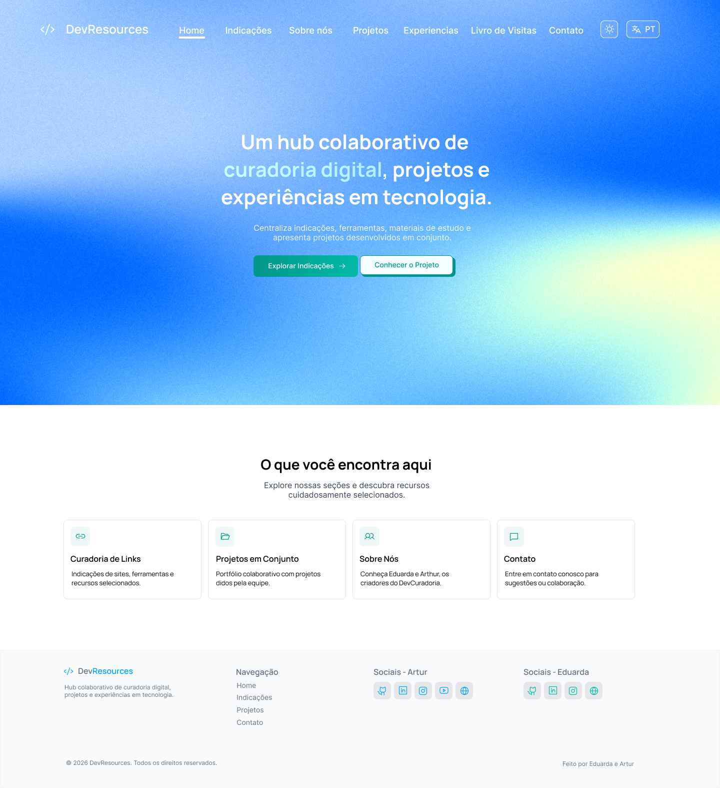
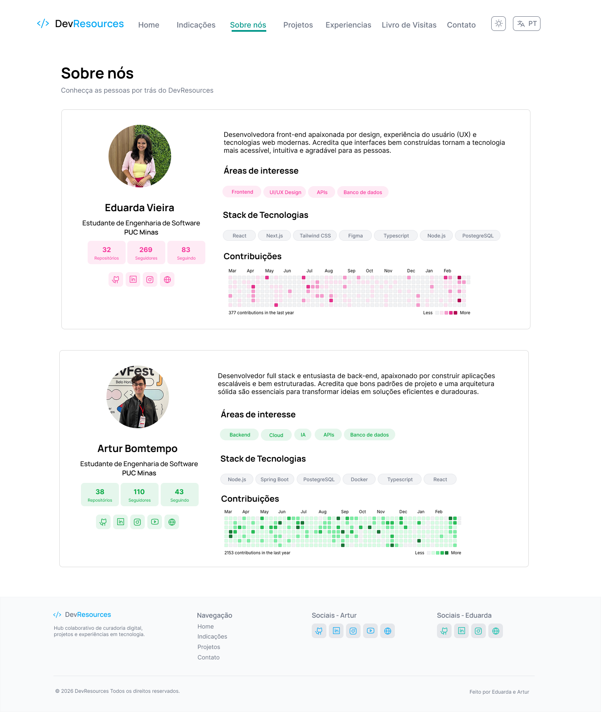
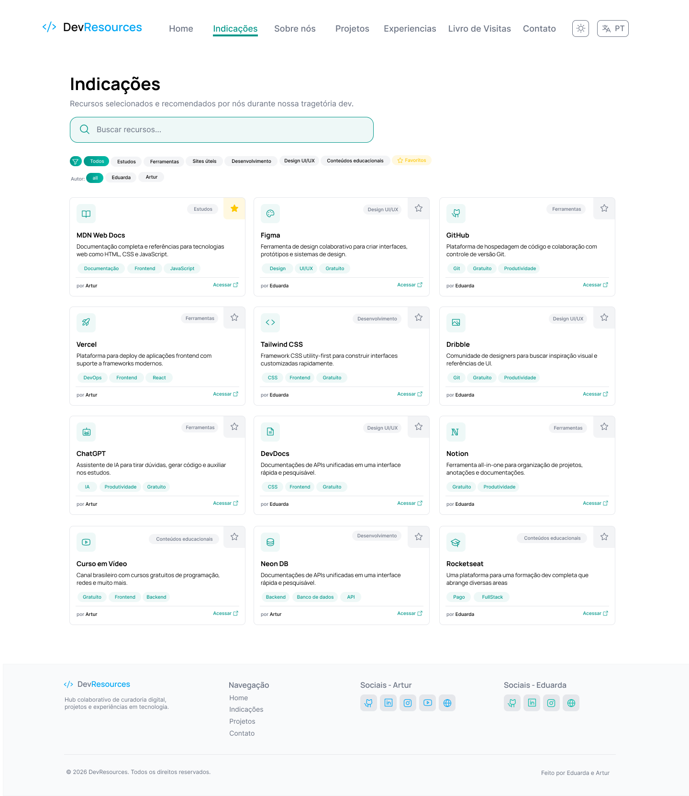
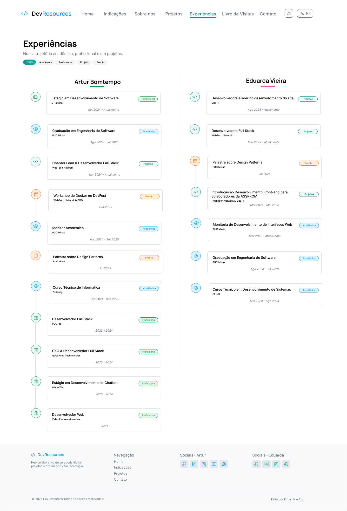
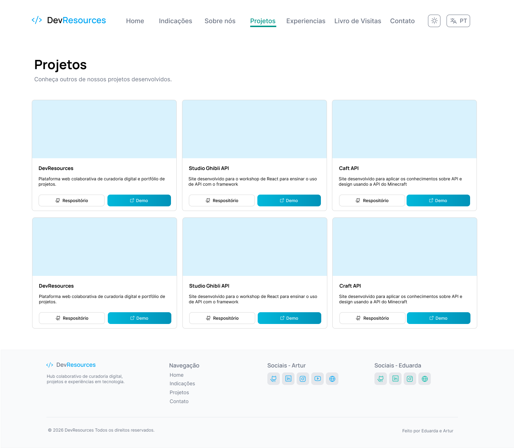
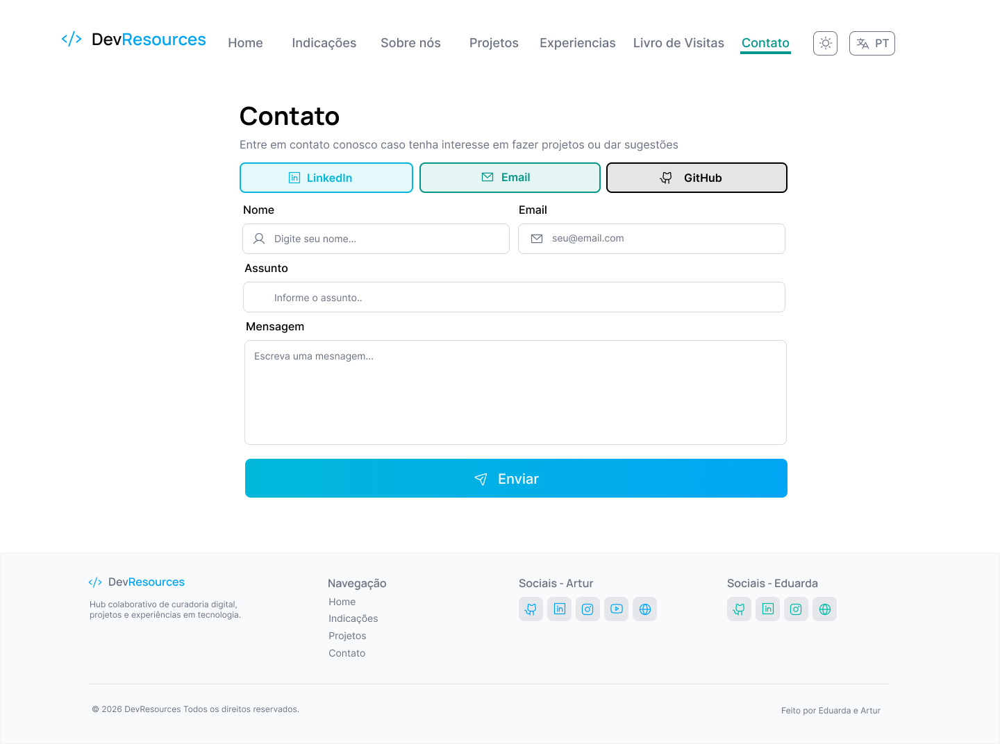
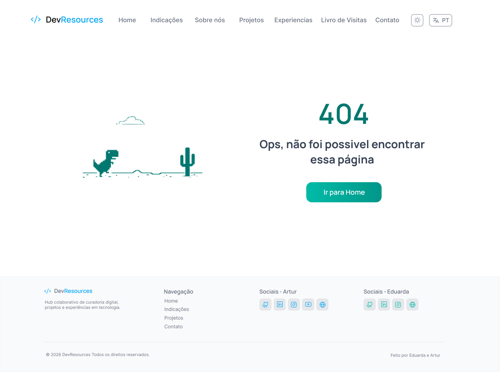

<div align="center">
  <h1>Dev Resources</h1>
  
  <p>
    
    
    
  </p>
  
  <p>
    
    
    
    
    
    
  </p>
</div>

<br>

<div align="justify">
O <b>Dev Resources</b> é uma plataforma de <i>curadoria de recursos técnicos</i> desenvolvida por <a href="https://github.com/arturbomtempo-dev">Artur Bomtempo</a> e <a href="https://github.com/eduardavieira-dev">Eduarda Vieira</a>, estudantes do <i>quarto período</i> do curso de <b>Engenharia de Software</b> da <b>PUC Minas</b>. Como <i>criadores de conteúdo digital</i> apaixonados por compartilhar conhecimento, desenvolvemos este projeto com o propósito de <b>auxiliar estudantes e profissionais de engenharia de software</b> a encontrarem <i>materiais confiáveis</i>, <i>recursos de qualidade</i> e <i>referências técnicas</i> centralizadas para estudo e resolução de dúvidas. A plataforma reúne de forma <i>organizada</i> e <i>acessível</i> conteúdos selecionados, projetos de referência e documentações, promovendo o <b>compartilhamento de conhecimento</b> e facilitando o <i>aprendizado da comunidade</i>. Além disso, permite o <i>contato direto</i> com os desenvolvedores para troca de experiências e esclarecimentos. O Dev Resources demonstra a aplicação prática de <b>boas práticas de engenharia de software</b>, promovendo <i>qualidade</i>, <i>documentação técnica</i> e <i>colaboração</i> no ecossistema de desenvolvimento.
</div>

---

## 📚 Índice

- [Links Úteis](#-links-úteis)
- [Sobre o Projeto](#-sobre-o-projeto)
- [Funcionalidades Principais](#-funcionalidades-principais)
- [Tecnologias Utilizadas](#-tecnologias-utilizadas)
- [Arquitetura](#-arquitetura)
- [Instalação e Execução](#-instalação-e-execução)
    - [Pré-requisitos](#pré-requisitos)
    - [Instalação de Dependências](#-instalação-de-dependências)
    - [Como Executar a Aplicação](#-como-executar-a-aplicação)
- [Deploy](#-deploy)
    - [Estrutura de Pastas](#-estrutura-de-pastas)
- [Demonstração](#-demonstração)
    - [Aplicação Web](#-aplicação-web)
- [Documentações utilizadas](#-documentações-utilizadas)
- [Autores](#-autores)
- [Contribuição](#-contribuição)
- [Agradecimentos](#-agradecimentos)
- [Licença](#-licença)

---

## 🔗 Links Úteis

- 🎨 **Figma:** [Protótipo da Aplicação](https://www.figma.com/design/tEP7aXt6oNFQvqBiwcl7lk/Projeto-DevResources?node-id=0-1&t=vz679nUtiYQB9XzV-1)
- 🌐 **Demo Online:** [Acesse a Aplicação Web](https://devresources-artur-eduarda.vercel.app/)

---

## 📝 Sobre o Projeto

O **Dev Resources** é uma plataforma de curadoria de recursos técnicos desenvolvida para resolver um problema comum entre estudantes de Engenharia de Software: a dificuldade de encontrar materiais didáticos confiáveis e de qualidade em meio à abundância de informação disponível na internet. Muitos alunos sabem que querem estudar e se aprofundar, mas não sabem por onde começar ou como filtrar conteúdos relevantes, resultando em uma sobrecarga informacional que dificulta o aprendizado.

Criado por estudantes de Engenharia de Software da PUC Minas apaixonados por compartilhar conhecimento, o projeto nasceu da vontade de centralizar informações relevantes e confiáveis da área em um único lugar. Como criadores de conteúdo digital, percebemos a necessidade de uma plataforma que não apenas agregasse recursos, mas que oferecesse curadoria, contexto e organização. A plataforma atende estudantes de graduação que buscam projetos de referência e materiais complementares, profissionais que desejam se atualizar, e permite que criadores de conteúdo compartilhem seus recursos e experiências com a comunidade. Além disso, facilita o contato direto entre desenvolvedores e estudantes para troca de conhecimento e esclarecimento de dúvidas.

Ao criar uma ponte entre a abundância de informação e o aprendizado efetivo, o **Dev Resources** contribui para formar profissionais mais preparados, promovendo boas práticas de engenharia de software e uma cultura de colaboração na comunidade acadêmica.

---

## ✨ Funcionalidades Principais

- 📚 **Curadoria de Recursos:** Catálogo de links úteis e confiáveis para materiais de tecnologia, documentações e referências técnicas de qualidade.
- 💼 **Portfólio de Projetos:** Galeria de projetos desenvolvidos pelos criadores, disponíveis para consulta, inspiração e estudo de código.
- 🔍 **Sistema de Filtragem:** Ferramentas de busca e filtros avançados para projetos e materiais, facilitando a localização de conteúdos específicos.
- 👥 **Sobre os Desenvolvedores:** Seção dedicada às informações, trajetória e experiências dos criadores da plataforma.
- 📧 **Página de Contato:** Canal direto de comunicação para dúvidas, sugestões e troca de conhecimento com os desenvolvedores.

---

## 🛠 Tecnologias Utilizadas

As seguintes ferramentas, frameworks e bibliotecas foram utilizados na construção deste projeto. Recomenda-se o uso das versões listadas (ou superiores) para garantir a compatibilidade.

### 💻 Front-end

- **Framework:** Next.js 16
- **Biblioteca UI:** React 19
- **Linguagem:** TypeScript 5
- **Estilização:** Tailwind CSS v4
- **Ícones:** Phosphor Icons
- **Linter:** ESLint 10 com simple-import-sort
- **Formatação:** Prettier 3.8 com tailwindcss plugin
- **Fontes:** Google Fonts (Inter, Manrope)

### ⚙️ Deploy

- **Plataforma:** Vercel (recomendado para Next.js)
- **CI/CD:** GitHub Actions (opcional)

---

## 🏗 Arquitetura

O **Dev Resources** adota uma arquitetura moderna baseada no **Next.js 16** com **App Router**, aproveitando os recursos mais recentes do framework para criar uma aplicação web performática e escalável. A escolha dessa arquitetura foi motivada pela necessidade de oferecer uma experiência de usuário fluida, com carregamento rápido de páginas e otimização automática de recursos.

### Visão Geral

A aplicação segue o padrão de **arquitetura em camadas** do Next.js, organizando o código de forma clara e modular:

- **Camada de Apresentação (UI):** Componentes React organizados e reutilizáveis, seguindo princípios de composição e separação de responsabilidades.
- **Camada de Roteamento:** Utiliza o App Router do Next.js para gerenciamento de rotas baseado em arquivos, com suporte a layouts aninhados e loading states.
- **Camada de Estilização:** Tailwind CSS v4 para estilização utilitária e consistente, com componentes UI customizados baseados em shadcn/ui.
- **Camada de Utilitários:** Funções auxiliares centralizadas para manipulação de dados e lógica compartilhada.

### Principais Componentes

**App Router (`src/app/`):** Gerencia todas as rotas da aplicação seguindo a estrutura de arquivos do Next.js. Cada pasta representa uma rota:

- `about/` - Página sobre os desenvolvedores
- `contact/` - Formulário de contato
- `experiences/` - Trajetória e experiências
- `indications/` - Links e recursos curados
- `projects/` - Portfólio de projetos

**Componentes Reutilizáveis (`src/components/`):** Componentes modulares organizados por funcionalidade:

- `Header/` e `Footer/` - Componentes de layout global
- `Loading/` - Estados de carregamento
- `Logo/` - Identidade visual
- `ui/` - Biblioteca de componentes UI (buttons, inputs, etc.)

**Utilitários (`src/lib/`):** Funções auxiliares para manipulação de classes CSS (clsx, tailwind-merge) e outras utilidades compartilhadas.

### Decisões Arquiteturais

**Next.js App Router:** Escolhido por oferecer Server Components por padrão, melhorando performance e SEO, além de simplificar o code splitting e lazy loading.

**TypeScript:** Implementado para garantir type safety, melhorar a experiência de desenvolvimento e reduzir bugs em produção.

**Tailwind CSS v4:** Adotado pela sua abordagem utility-first que acelera o desenvolvimento, garante consistência visual e reduz o tamanho final do CSS.

**Component-Based Architecture:** Estrutura modular que facilita manutenção, testes e reuso de código, seguindo as melhores práticas do ecossistema React.

**File-Based Routing:** Simplifica a estrutura do projeto e torna a navegação mais intuitiva, com rotas diretamente mapeadas para a estrutura de pastas.

---

## 🔧 Instalação e Execução

### Pré-requisitos

- **Node.js:** Versão LTS (v22.x ou superior)
- **Gerenciador de Pacotes:** npm ou yarn

---

### 📦 Instalação de Dependências

Clone o repositório e instale as dependências.

1. **Clone o Repositório:**

```bash
git clone https://github.com/arturbomtempo-dev/dev-resources.git
cd dev-resources
```

2. **Instale as Dependências:**

Instale as dependências do projeto Next.js:

```bash
npm install
# ou
yarn install
```

---

### ⚡ Como Executar a Aplicação

Execute a aplicação em modo de desenvolvimento:

```bash
npm run dev
# ou
yarn dev
```

🎨 _A aplicação estará disponível em **http://localhost:3000**._

---

## 🚀 Deploy

O projeto está configurado para deploy automático na Vercel:

1. **Importação do Repositório:** Importe o repositório do GitHub na [Vercel](https://vercel.com)
2. **Configuração Automática:** A Vercel detecta automaticamente o projeto Next.js e aplica as configurações necessárias
3. **Deploy Contínuo:** Cada push na branch principal gera um novo deploy automaticamente

Para testar o build de produção localmente:

```bash
npm run build
npm start
```

---

### 📂 Estrutura de Pastas

A estrutura do projeto segue as convenções do Next.js 16 com App Router, organizando código, componentes e recursos de forma clara e escalável.

```
dev-resources/
├── .gitignore                   # 🧹 Arquivos e pastas ignorados pelo Git
├── .prettierrc                  # 🎨 Configuração do Prettier para formatação de código
├── .vscode/                     # ⚙️ Configurações do VS Code (opcional)
├── README.md                    # 📘 Documentação principal do projeto
├── components.json              # 🧩 Configuração do shadcn/ui
├── eslint.config.mjs            # ✨ Configuração do ESLint para qualidade de código
├── next.config.ts               # ⚙️ Configurações do Next.js
├── next-env.d.ts                # 📝 Tipos TypeScript do Next.js
├── package.json                 # 📦 Dependências e scripts do projeto
├── package-lock.json            # 🔒 Lockfile das dependências
├── postcss.config.mjs           # 🎨 Configuração do PostCSS
├── tsconfig.json                # 📘 Configuração do TypeScript
│
├── /public                      # 📂 Arquivos estáticos públicos
│   ├── file.svg                 # 🖼️ Ícones e SVGs
│   ├── globe.svg
│   ├── next.svg
│   ├── vercel.svg
│   └── window.svg
│
├── /resources                   # 📂 Recursos do projeto
│   ├── logo.png                 # 🖼️ Logo da plataforma
│   └── /prototype               # 📸 Screenshots do protótipo Figma
└── /src                         # 📂 Código-fonte da aplicação
    │
    ├── /app                     # 📂 App Router (rotas e layouts)
    │   ├── globals.css          # 🎨 Estilos globais da aplicação
    │   ├── Grainient.tsx        # 🎨 Componente de efeito visual de fundo
    │   ├── layout.tsx           # 📐 Layout raiz da aplicação
    │   ├── template.tsx         # 📄 Template compartilhado
    │   ├── page.tsx             # 🏠 Página inicial (Home)
    │   ├── loading.tsx          # ⏳ Estado de carregamento global
    │   ├── not-found.tsx        # 🔍 Página de erro 404
    │   │
    │   ├── /about               # 📂 Rota /about
    │   │   └── page.tsx         # 📄 Página sobre os desenvolvedores
    │   │
    │   ├── /contact             # 📂 Rota /contact
    │   │   └── page.tsx         # 📄 Página de contato
    │   │
    │   ├── /experiences         # 📂 Rota /experiences
    │   │   └── page.tsx         # 📄 Página de experiências
    │   │
    │   ├── /indications         # 📂 Rota /indications
    │   │   └── page.tsx         # 📄 Página de indicações/recursos
    │   │
    │   └── /projects            # 📂 Rota /projects
    │       └── page.tsx         # 📄 Página de projetos
    │
    ├── /components              # 📂 Componentes React reutilizáveis
    │   ├── /Footer              # 🦶 Componente de rodapé
    │   │   └── index.tsx
    │   ├── /Header              # 📌 Componente de cabeçalho/navegação
    │   │   └── index.tsx
    │   ├── /Loading             # ⏳ Componente de loading
    │   │   └── index.tsx
    │   ├── /Logo                # 🎨 Componente do logo
    │   │   └── index.tsx
    │   └── /ui                  # 🧩 Componentes UI (shadcn/ui)
    │       └── button.tsx       # 🔘 Componente de botão
    │
    └── /lib                     # 📂 Utilitários e helpers
        └── utils.ts             # 🛠️ Funções auxiliares (clsx, tw-merge, etc.)
```

---

## 🎥 Demonstração

Veja a aplicação funcionando em tempo real:

#### Página Inicial (Home)


_Navegação fluida com header transparente que se adapta ao scroll, animações suaves e design responsivo da página inicial com hero section e gradiente animado WebGL._

---

> Mais demonstrações em vídeo de outras páginas serão adicionadas em breve.

### 🌐 Aplicação Web

Para melhor visualização, as telas principais estão organizadas lado a lado.

|                                             Tela                                             |                                      Captura de Tela                                       |
| :------------------------------------------------------------------------------------------: | :----------------------------------------------------------------------------------------: |
|                                  **Página Inicial (Home)**                                   |                                       **Sobre Nós**                                        |
|  |              |
|                                        **Indicações**                                        |                                      **Experiências**                                      |
|      |  |
|                                         **Projetos**                                         |                                        **Contato**                                         |
|           |           |
|                                         **Erro 404**                                         |                                                                                            |
|        |                                                                                            |

---

## 🔗 Documentações utilizadas

- 📖 **Next.js:** [Documentação Oficial do Next.js](https://nextjs.org/docs)
- 📖 **React:** [Documentação Oficial do React](https://react.dev/reference/react)
- 📖 **TypeScript:** [Documentação do TypeScript](https://www.typescriptlang.org/docs/)
- 📖 **Tailwind CSS:** [Documentação do Tailwind CSS](https://tailwindcss.com/docs)
- 📖 **Vercel:** [Documentação de Deploy da Vercel](https://vercel.com/docs)

---

## 👥 Autores

Conheça os desenvolvedores responsáveis por este projeto:

| 👤 Nome                  | 🖼️ Foto                                                                                                                                           | :octocat: GitHub                                                                                                                                                         | 💼 LinkedIn                                                                                                                                                                                                | 📤 Gmail                                                                                                                                                                       |
| ------------------------ | ------------------------------------------------------------------------------------------------------------------------------------------------- | ------------------------------------------------------------------------------------------------------------------------------------------------------------------------ | ---------------------------------------------------------------------------------------------------------------------------------------------------------------------------------------------------------- | ------------------------------------------------------------------------------------------------------------------------------------------------------------------------------ |
| Artur Bomtempo Colen     | <div align="center"></div>  | <div align="center"><a href="https://github.com/arturbomtempo-dev"></a></div> | <div align="center"><a href="https://www.linkedin.com/in/artur-bomtempo/"></a></div>                          | <div align="center"><a href="mailto:arturbcolen@gmail.com"></a></div>                |
| Eduarda Vieira Gonçalves | <div align="center"></div> | <div align="center"><a href="https://github.com/eduardavieira-dev"></a></div> | <div align="center"><a href="https://www.linkedin.com/in/eduarda-vieira-gon%C3%A7alves-01a584297/"></a></div> | <div align="center"><a href="mailto:eduarda.vieira.goncalves7@gmail.com"></a></div> |

---

## 🤝 Contribuição

Guia para contribuições ao projeto.

1.  Faça um `fork` do projeto.
2.  Crie uma branch para sua feature (`git checkout -b feature/minha-feature`).
3.  Commit suas mudanças (`git commit -m 'feat: Adiciona nova funcionalidade X'`). **(Utilize [Conventional Commits](https://www.conventionalcommits.org/en/v1.0.0/))**
4.  Faça o `push` para a branch (`git push origin feature/minha-feature`).
5.  Abra um **Pull Request (PR)**.

---

## 🙏 Agradecimentos

Esta seção reconhece as instituições, professores e iniciativas que contribuíram significativamente para a realização deste projeto acadêmico.

- [**Engenharia de Software PUC Minas**](https://www.instagram.com/engsoftwarepucminas/) - Pelo suporte institucional, infraestrutura acadêmica e incentivo à aplicação prática de conhecimentos técnicos em engenharia de software.

- [**Prof. Dr. João Paulo Aramuni**](https://github.com/joaopauloaramuni) - Pela orientação acadêmica e oportunidade oferecida para o desenvolvimento deste projeto, possibilitando a aplicação de conceitos e metodologias de engenharia de software em um contexto real.

- [**WebTech Network**](https://webtech.network/) - Projeto de extensão da PUC Minas que tem proporcionado oportunidades práticas para desenvolvimento de habilidades em tecnologias front-end e back-end, complementando a formação acadêmica com experiência aplicada em projetos reais.

---

## 📄 Licença

Este projeto é distribuído sob a **[Licença MIT](./LICENSE.md)**.
