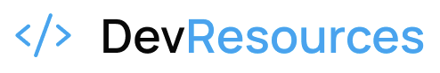

<a href="https://classroom.github.com/online_ide?assignment_repo_id=99999999&assignment_repo_type=AssignmentRepo"></a> <a href="https://classroom.github.com/open-in-codespaces?assignment_repo_id=99999999"></a>

---

# Dev Resources

<table>
  <tr>
    <td width="800px">
      <div align="justify">
        O <b>Dev Resources</b> é uma plataforma de <i>curadoria de recursos técnicos</i> desenvolvida por <a href="https://github.com/arturbomtempo-dev">Artur Bomtempo</a> e <a href="https://github.com/eduardavieira-dev">Eduarda Vieira</a>, estudantes do <i>quarto período</i> do curso de <b>Engenharia de Software</b> da <b>PUC Minas</b>. Este projeto representa o <i>primeiro trabalho</i> da disciplina <b>Laboratório de Desenvolvimento de Software</b>, tendo como propósito <b>auxiliar estudantes e profissionais de engenharia de software</b> a encontrarem <i>materiais confiáveis</i>, <i>recursos de qualidade</i> e <i>referências técnicas</i> para estudo e resolução de dúvidas. A plataforma reúne de forma <i>organizada</i> e <i>acessível</i> conteúdos selecionados, projetos de referência e documentações, promovendo o <b>compartilhamento de conhecimento</b> e facilitando o <i>aprendizado da comunidade</i>. Além disso, permite o <i>contato direto</i> com os desenvolvedores para troca de experiências e esclarecimentos. O Dev Resources demonstra a aplicação prática de <b>boas práticas de engenharia de software</b>, promovendo <i>qualidade</i>, <i>documentação técnica</i> e <i>colaboração</i> no ecossistema de desenvolvimento.
      </div>
    </td>
    <td>
      <div>
        
      </div>
    </td>
  </tr> 
</table>

---

## 🚧 Status do Projeto

### Exemplos de badges básicos:

[](https://github.com/joaopauloaramuni/joaopauloaramuni/actions/workflows/main.yml)
[](https://codecov.io/gh/joaopauloaramuni/laboratorio-de-desenvolvimento-de-software)
[](https://github.com/joaopauloaramuni/laboratorio-de-desenvolvimento-de-software/releases)
[](#licença)

### Outros exemplos de badges:

[](https://github.com/joaopauloaramuni/laboratorio-de-desenvolvimento-de-software/releases)                

---

## 📚 Índice

- [Links Úteis](#-links-úteis)
- [Sobre o Projeto](#-sobre-o-projeto)
- [Funcionalidades Principais](#-funcionalidades-principais)
- [Tecnologias Utilizadas](#-tecnologias-utilizadas)
- [Arquitetura](#-arquitetura)
    - [Exemplos de diagramas](#exemplos-de-diagramas)
- [Instalação e Execução](#-instalação-e-execução)
    - [Pré-requisitos](#pré-requisitos)
    - [Variáveis de Ambiente](#-variáveis-de-ambiente)
        - [1 Back-end (Spring Boot)](#1-back-end-spring-boot)
        - [2 Front-end (React, Vite)](#2-front-end-react-vite)
        - [3 Exemplos de Variáveis de Ambiente na Vercel](#3-exemplos-de-variáveis-de-ambiente-na-vercel)
    - [Instalação de Dependências](#-instalação-de-dependências)
        - [Front-end (React)](#front-end-react)
        - [Back-end (Spring Boot)](#back-end-spring-boot)
    - [Inicialização do Banco de Dados (PostgreSQL)](#-inicialização-do-banco-de-dados-postgresql)
    - [Como Executar a Aplicação](#-como-executar-a-aplicação)
        - [Terminal 1: Back-end (Spring Boot)](#terminal-1-back-end-spring-boot)
        - [Terminal 2: Front-end (React, Vite)](#terminal-2-front-end-react-vite)
        - [Execução Local Completa com Docker Compose (Incluindo Banco de Dados)](#-execução-local-completa-com-docker-compose-incluindo-banco-de-dados)
        - [Passos para build, inicialização e execução](#-passos-para-build-inicialização-e-execução)
- [Deploy](#-deploy)
- [Estrutura de Pastas](#-estrutura-de-pastas)
- [Demonstração](#-demonstração)
    - [Aplicativo Mobile](#-aplicativo-mobile)
    - [Aplicação Web](#-aplicação-web)
    - [Exemplo de saída no Terminal (para Back-end, API, CLI)](#-exemplo-de-saída-no-terminal-para-back-end-api-cli)
- [Testes](#-testes)
- [Documentações utilizadas](#-documentações-utilizadas)
- [Autores](#-autores)
- [Contribuição](#-contribuição)
- [Agradecimentos](#-agradecimentos)
- [Licença](#-licença)

---

## 🔗 Links Úteis

- 🌐 **Demo Online:** [Acesse a Aplicação Web](link-da-demo-web)
    > 💻 **Descrição:** Link para a aplicação em ambiente de produção (Ex: hospedado na Vercel, Netlify ou AWS S3).
- 📱 **Download Mobile:** [App Store](link-app-store) | [Google Play](link-google-play) | [APK Direto](link-para-apk-direto)
    > 📱 **Descrição:** Links diretos para download nas lojas de aplicativos (se aplicável) e para o arquivo de instalação direta no Android (APK).
- 📖 **Documentação:** [Leia a Wiki/Docs](link-para-docs)
    > 📚 **Descrição:** Acesso à documentação técnica completa do projeto (Ex: Swagger/OpenAPI para API, ou Wiki interna).

---

## 📝 Sobre o Projeto

Nesta seção, descreva de forma clara e objetiva **o propósito do seu projeto**, explicando:

- **Por que ele existe** — qual motivação levou à sua criação.
- **Qual problema ele resolve** — que dor, necessidade ou oportunidade ele atende.
- **Qual o contexto** — acadêmico, profissional, pessoal, experimental, etc.
- **Onde ele pode ser utilizado** — cenários reais ou simulados.

Procure responder perguntas como:

- _Qual foi a ideia inicial do projeto?_
- _O que ele entrega de valor ao usuário?_
- _Por que alguém utilizaria ou contribuiria com esse projeto?_
- _O que o torna relevante ou interessante?_

Escreva de forma objetiva, mas completa, para que qualquer pessoa entenda rapidamente **o que é** e **por que importa**.

> [!NOTE]
> Esta seção segue boas práticas de documentação profissional e deve ser ajustada conforme o tipo e o objetivo do seu projeto.

---

## ✨ Funcionalidades Principais

Liste as funcionalidades de forma clara e objetiva.

- 🔐 **Autenticação Segura:** Login, Cadastro e Recuperação de Senha.
- 📈 **Painel de Controle:** Visualização de dados em tempo real com gráficos.
- ⚙️ **Gerenciamento de CRUD:** Criação, Leitura, Atualização e Deleção de recursos (e.g., Usuários, Itens, Posts).
- 📊 **Relatórios Exportáveis:** Exportação de dados em PDF, CSV ou Excel.
- 🌐 **Internacionalização (i18n):** Suporte a múltiplos idiomas.
- 🧵 **Logs e Monitoramento:** Registro detalhado de atividades e análise de desempenho.
- 🔄 **Integração com APIs Externas:** Conexão com serviços de terceiros (pagamentos, mapas, autenticação, etc.).
- 📨 **Sistema de Notificações:** Envio de alertas por e-mail, push ou notificações internas.

---

## 🛠 Tecnologias Utilizadas

As seguintes ferramentas, frameworks e bibliotecas foram utilizados na construção deste projeto. Recomenda-se o uso das versões listadas (ou superiores) para garantir a compatibilidade.

### 💻 Front-end

- **Framework:** Next.js 16
- **Biblioteca UI:** React 19
- **Linguagem:** TypeScript 5
- **Estilização:** Tailwind CSS v4
- **Ícones:** Phosphor Icons
- **Linter:** ESLint 10 com simple-import-sort
- **Formatação:** Prettier 3.8 com tailwindcss plugin
- **Fontes:** Google Fonts (Inter, Manrope)

### ⚙️ Deploy

- **Plataforma:** Vercel (recomendado para Next.js)
- **CI/CD:** GitHub Actions (opcional)

---

## 🏗 Arquitetura

Descreva aqui a **arquitetura completa do sistema**, explicando como as camadas, módulos e componentes foram organizados. Informe também **por que** essa arquitetura foi escolhida e **quais problemas ela ajuda a resolver**.

Você pode incluir:

- **Visão geral da arquitetura** (ex.: camadas, módulos, microsserviços, monólito modular, hexagonal, MVC etc.)
- **Principais componentes** e o papel de cada um
- **Padrões de design adotados** (ex.: Repository, Service Layer, DTOs, Factory, Observer)
- **Fluxo de dados** entre as partes do sistema
- **Tecnologias utilizadas em cada camada**
- **Decisões arquiteturais importantes**
- **Trade-offs** ou limitações relevantes

### Exemplos de diagramas

Para melhor visualização e entendimento da estrutura do sistema, os diagramas principais estão organizados lado a lado.

|                                                              Diagrama de Arquitetura                                                              |                                                            Detalhe da Arquitetura                                                            |
| :-----------------------------------------------------------------------------------------------------------------------------------------------: | :------------------------------------------------------------------------------------------------------------------------------------------: |
|                                                              **Visão Geral (Macro)**                                                              |                                                        **Camada de Serviço (Micro)**                                                         |
|         |  |
|                                                          **Modelo de Dados (Entidades)**                                                          |                                                          **Fluxo de Autenticação**                                                           |
|  |        |
|                                                            **Infraestrutura (Cloud)**                                                             |                                                           **API Gateway (Rotas)**                                                            |
|           |              |

---

## 🔧 Instalação e Execução

### Pré-requisitos

Certifique-se de que o usuário tenha o ambiente configurado.

- **Node.js:** Versão LTS (v18.x ou superior)
- **Gerenciador de Pacotes:** npm ou yarn
- **Docker** (Opcional, mas **altamente recomendado** para rodar o Banco de Dados)

---

### 🔑 Variáveis de Ambiente

Crie arquivos `.env` específicos e/ou configure as variáveis de ambiente no seu sistema para cada parte da aplicação.

#### Front-end (Next.js)

Crie um arquivo **`.env.local`** na raiz do projeto Next.js. Use o prefixo `NEXT_PUBLIC_` para expor variáveis ao cliente.

| Variável                         | Descrição                                        | Exemplo                      |
| :------------------------------- | :----------------------------------------------- | :--------------------------- |
| `NEXT_PUBLIC_SITE_URL`           | URL do site em produção.                         | `https://meusite.vercel.app` |
| `NEXT_PUBLIC_EMAILJS_PUBLIC_KEY` | Chave pública para serviços de e-mail (Exemplo). | `sua_public_key_aqui`        |
| `NEXT_PUBLIC_GOOGLE_MAPS_KEY`    | Chave de API para serviços de mapas (Opcional).  | `AIzaSy...`                  |

---

#### Exemplos de Variáveis de Ambiente na Vercel

A Vercel permite configurar variáveis no painel (Project Settings > Environment Variables).

##### **Exemplo – Front-end Next.js com APIs externas**

```
NEXT_PUBLIC_API_URL=https://api.exemplo.com
NEXT_PUBLIC_GOOGLE_ANALYTICS_ID=G-seu_google_analytics_id_aqui
NEXT_PUBLIC_SITE_URL=https://meu-sistema.vercel.app
```

---

Para adicionar essas variáveis:

1.  Acesse a página de Environment Variables do seu projeto no Vercel (ex.: `https://vercel.com/<seu-usuario>/<seu-projeto>/settings/environment-variables`)
2.  Clique em **"Add"** para adicionar cada variável com o nome e valor correspondente.

Alternativamente, se estiver desenvolvendo localmente, crie um arquivo **`.env.local`** dentro da pasta **`frontend`** do seu projeto com o seguinte conteúdo:

```
# Variável essencial para conectar ao Back-end Spring Boot rodando localmente (normalmente na porta 8080)
VITE_API_URL=http://localhost:8080/api

# Variáveis para integrações externas de serviço de e-mail
VITE_EMAILJS_SERVICE_ID=seu_service_id_aqui
VITE_EMAILJS_TEMPLATE_ID_FOR_ME=seu_template_id_for_me_aqui
VITE_EMAILJS_TEMPLATE_ID_FOR_SENDER=seu_template_id_for_sender_aqui
VITE_EMAILJS_PUBLIC_KEY=sua_public_key_aqui

# Outras chaves de serviço
VITE_GOOGLE_MAPS_KEY=AIzaSy...
```

> 💡 **Localização:** Garanta que este arquivo esteja em **`/frontend/.env.local`** para que o **Vite** consiga carregá-lo e disponibilizar as variáveis para o Front-end durante o desenvolvimento.

### 📦 Instalação de Dependências

Clone o repositório e instale as dependências.

1.  **Clone o Repositório:**

```bash
git clone <URL_DO_SEU_REPOSITÓRIO>
cd <pasta-do-projeto>
```

2.  **Instale as Dependências (Monorepo):**

Como o projeto está dividido, você precisa instalar as dependências separadamente para o Front-end (React, usando NPM/Yarn) e garantir que o Back-end (Spring Boot, usando Maven/Gradle Wrapper) tenha suas dependências resolvidas.

Instale as dependências do projeto Next.js:

```bash
npm install
# ou
yarn install
```

---

### ⚡ Como Executar a Aplicação

Execute a aplicação em modo de desenvolvimento:

```bash
npm run dev
# ou
yarn dev
```

🎨 _A aplicação estará disponível em **http://localhost:3000**._

---

Instruções claras para deploy em produção.

1.  **Build do Projeto:**
Execute o build separadamente para os dois artefatos (JAR para o Back-end e arquivos estáticos para o Front-end).

```bash
# 1. Build do Front-end (React/Vite) - Gera a pasta /dist com arquivos estáticos
cd frontend
npm run build

# 2. Build do Back-end (Spring Boot/Maven) - Gera o arquivo .jar executável em /target
cd ../backend
./mvnw clean package
```

2.  **Configuração do Ambiente de Produção:** Defina as variáveis de ambiente no seu provedor (e.g., Vercel, Railway, Heroku, DigitalOcean).

> 🔑 **Variáveis Cruciais:** Certifique-se de configurar as variáveis de **conexão com o banco de dados** (`SPRING_DATASOURCE_URL`, etc.) para o Back-end e a **URL da API de produção** (`VITE_API_URL`) para o Front-end.

3.  **Execução em Produção:**
A forma de execução depende do seu provedor, mas geralmente envolve o seguinte:

```bash
# ☕ Execução do Back-end Spring Boot (Java JAR)
# Este comando inicia a API usando o artefato JAR gerado.
java -jar backend/target/nome-do-do-projeto-0.0.1-SNAPSHOT.jar

# 🟢 Execução do Front-end (React/Vite)
# O Front-end (arquivos estáticos) não é executado via Node, mas servido por um servidor web.
# Exemplo de servidor de arquivos estáticos (usando Nginx, Vercel, Netlify, etc.)
# Para simular a produção localmente ou rodar em uma VPS simples, use o pacote 'serve':
npm install -g serve
serve -s frontend/dist
```

---

## 📂 Estrutura de Pastas

Descreva o propósito das pastas principais.

```
.
├── .editorconfig                # ✍️ Padronização de estilo de código.
├── .env.local                   # 🔒 Variáveis SENSÍVEIS do ambiente LOCAL (não versionado).
├── .env.test                    # 🧪 Variáveis de ambiente para TESTES AUTOMATIZADOS.
├── .env.staging                 # ☁️ Variáveis de ambiente para STAGING/HOMOLOGAÇÃO.
├── .env.example                 # 🧩 Exemplo de TODAS as variáveis necessárias (sem valores sensíveis).
├── .gitignore                   # 🧹 Ignora arquivos/pastas não versionadas (.env, node_modules, target, etc.).
├── .vscode/                     # ⚙️ Configurações de ambiente da IDE (opcional).
├── .github/                     # 🤖 CI/CD (Actions), templates de Issues e Pull Requests.
├── README.md                    # 📘 Documentação principal do projeto.
├── CONTRIBUTING.md              # 🤝 Guia de contribuição.
├── LICENSE                      # ⚖️ Licença do projeto.
├── docker-compose.yml           # 🐳 Orquestração dos containers (front/back/db/etc).
├── docker-compose.override.yml  # 🐳 Configurações extras apenas para desenvolvimento.
│
├── /frontend                    # 📁 Aplicação React
│   ├── .env.example             # 🧩 Variáveis de ambiente do Front-end.
│   ├── Dockerfile               # 🐳 Docker build do Front-end.
│   ├── .eslintrc.js             # ✨ Regras do ESLint.
│   ├── .prettierrc              # 🎨 Configuração do Prettier.
│   ├── /public                  # 📂 Arquivos estáticos e index.html.
│   ├── /src                     # 📂 Código-fonte React
│   │   ├── /components          # 🧱 Componentes reutilizáveis (UI).
│   │   ├── /pages               # 📄 Páginas/rotas da aplicação.
│   │   ├── /services            # 🔌 Serviços e chamadas HTTP.
│   │   ├── /hooks               # 🎣 Hooks personalizados.
│   │   ├── /styles              # 🎨 Estilos globais, temas, Design System.
│   │   ├── /assets              # 🖼️ Recursos estáticos importados
│   │   │   ├── /images          # 🖼️ Imagens.
│   │   │   ├── /icons           # 💡 Ícones.
│   │   │   └── /fonts           # ✒️ Fontes personalizadas.
│   │   └── /utils               # 🛠️ Funções utilitárias.
│   ├── package.json             # 📦 Dependências e scripts.
│   └── yarn.lock / package-lock.json # 🔒 Lockfile das dependências.
│
├── /backend                     # 📁 Aplicação Spring Boot
│   ├── .env.example             # 🧩 Variáveis de ambiente do Back-end.
│   ├── Dockerfile               # 🐳 Docker build do Back-end.
│   │
│   ├── /src/main/java           # 📂 Código-fonte Java
│   │   └── /com/exemplo/app
│   │       ├── /controller      # 🎮 Endpoints REST.
│   │       ├── /service         # ⚙️ Regras e lógica de negócio.
│   │       ├── /repository      # 🗄️ Repositórios (JPA/Hibernate).
│   │       ├── /model           # 🧬 Entidades persistentes (JPA).
│   │       ├── /domain          # 🌐 Objetos de Domínio puro (sem anotações).
│   │       ├── /dto             # ✉️ Data Transfer Objects.
│   │       ├── /config          # 🔧 Configurações gerais (DB, Swagger, CORS, etc.).
│   │       ├── /exception       # 💥 Exceptions e handlers globais.
│   │       └── /security        # 🛡️ Autenticação e Autorização (Spring Security).
│   │
│   ├── /src/main/resources      # 📂 Recursos do Spring Boot
│   │   ├── application.yml         # ⚙️ Configuração principal da aplicação
│   │   ├── application-dev.yml     # 🧪 Configurações específicas do ambiente de DESENVOLVIMENTO
│   │   ├── application-prod.yml    # 🚀 Configurações específicas para PRODUÇÃO
│   │   ├── application-test.yml    # 🧪 Configurações usadas nos testes automatizados
│   │   ├── /static                # 🌐 Arquivos estáticos (HTML/CSS/JS).
│   │   ├── /templates             # 🖼️ Templates Thymeleaf/Freemarker.
│   │   ├── /messages              # 🌎 Arquivos de internacionalização (i18n).
│   │   └── /db                    # 💾 Scripts de banco usados pela aplicação
│   │       └── /migration         # 📜 Migrações do banco (Flyway/Liquibase).
│   │
│   ├── /src/test/java            # 🧪 Testes unitários e de integração.
│   └── pom.xml / build.gradle    # 🛠️ Build e dependências.
│
├── /scripts                      # 📜 Scripts de automação
│   ├── dev.sh                    # 🚀 Ambiente de desenvolvimento completo.
│   ├── build_all.sh              # 🛠️ Build geral (front + back).
│   └── deploy.sh                 # ☁️ Deploy em produção/homologação.
│
├── /docs                         # 📚 Documentação, arquitetura, modelos C4, Swagger/OpenAPI.
└── /tests                        # 🧪 Testes End-to-End (Cypress/Playwright).
```

---

## 🎥 Demonstração

Use GIFs e prints para mostrar o projeto em ação.

> [!WARNING]
> Dê preferência a hospedar suas imagens em um **CDN** (Content Delivery Network) ou no **GitHub Pages** para garantir que elas carreguem rapidamente e não quebrem. Saiba mais sobre o GitHub Pages clicando [aqui](https://github.com/joaopauloaramuni/joaopauloaramuni.github.io).

### 📱 Aplicativo Mobile

- GIF de demonstração (exemplo de fluxo de usuário):

| Demonstração 1                                                                                                   | Demonstração 2                                                                                                   | Demonstração 3                                                                                                   | Demonstração 4                                                                                                   |
| ---------------------------------------------------------------------------------------------------------------- | ---------------------------------------------------------------------------------------------------------------- | ---------------------------------------------------------------------------------------------------------------- | ---------------------------------------------------------------------------------------------------------------- |
|  |  |  |  |
| _Sua gif aqui_                                                                                                   | _Sua gif aqui_                                                                                                   | _Sua gif aqui_                                                                                                   | _Sua gif aqui_                                                                                                   |

Para melhor visualização, as telas principais estão organizadas lado a lado.

|                                                           Tela                                                           |                                                     Captura de Tela                                                      |
| :----------------------------------------------------------------------------------------------------------------------: | :----------------------------------------------------------------------------------------------------------------------: |
|                                                 **Tela Inicial (Home)**                                                  |                                              **Tela de Perfil / Settings**                                               |
|  |  |
|                                                   **Tela de Cadastro**                                                   |                                               **Tela de Lista / Detalhes**                                               |
|  |  |

### 🌐 Aplicação Web

Para melhor visualização, as telas principais estão organizadas lado a lado.

|                                                                 Tela                                                                  |                                                           Captura de Tela                                                            |
| :-----------------------------------------------------------------------------------------------------------------------------------: | :----------------------------------------------------------------------------------------------------------------------------------: |
|                                                       **Página Inicial (Home)**                                                       |                                                         **Página de Login**                                                          |
|  |                 |
|                                                       **Cadastro de Clientes**                                                        |                                                       **Cadastro de Produtos**                                                       |
|   |  |
|                                                      **Dashboard (Visão Geral)**                                                      |                                                   **Página Admin / Configurações**                                                   |
|              |           |

### 💻 Exemplo de Saída no Terminal (para Back-end, API, CLI)

Caso o projeto seja focado em serviços de Back-end (API, microserviço, CLI), utilize esta seção para demonstrar a interação com o sistema e a resposta esperada.

#### 1. Demonstração da API (Exemplo com cURL)

Mostra uma chamada simples para um endpoint da API (ex: GET de listagem).

```bash
# Chama o endpoint de listagem de usuários com o token de autenticação
curl -X GET 'http://localhost:3000/api/v1/users' \
     -H 'Authorization: Bearer <seu-jwt-token>'
```

**Saída Esperada:**

```json
{
    "total": 2,
    "users": [
        {
            "id": "1a2b3c",
            "name": "Prof. Aramuni",
            "email": "contato@exemplo.com",
            "status": "active"
        },
        {
            "id": "4d5e6f",
            "name": "Colaborador Teste",
            "email": "teste@exemplo.com",
            "status": "inactive"
        }
    ]
}
```

---

#### 2. Demonstração de Execução de CLI/Script

Mostra como executar uma ferramenta de linha de comando ou um script de manutenção do projeto (ex: rodar migrações ou um job agendado).

```bash
# Executa a ferramenta de validação de Schema
npm run cli validate:schema --target=production
```

**Saída Esperada:**

```text
[INFO] Iniciando validação do banco de dados...
[SUCCESS] 15/15 tabelas verificadas.
[WARNING] Coluna 'descricao' na tabela 'produtos' é nullable.
[SUCCESS] Validação concluída. Nenhum erro crítico encontrado.
Tempo de execução: 1.25s
```

---

## 🧪 Testes

### Testes Unitários e de Integração

Para rodar os testes da unidade e integração:

```
npm run test
```

_Ferramenta utilizada: Jest, Vitest, Mocha, etc._

### Testes End-to-End (E2E)

Para rodar os testes de ponta a ponta (E2E):

```
npm run test:e2e
```

_Ferramenta utilizada: Cypress, Playwright, Selenium, etc._

---

## 🔗 Documentações utilizadas

Liste aqui links para documentação técnica, referências de bibliotecas complexas ou guias de estilo que foram cruciais para o projeto.

- 📖 **Framework/Biblioteca (Front-end):** [Documentação Oficial do **React**](https://react.dev/reference/react)
- 📖 **Build Tool (Front-end):** [Guia de Configuração do **Vite**](https://vitejs.dev/config/)
- 📖 **Framework (Back-end):** [Documentação Oficial do **Spring Boot**](https://docs.spring.io/spring-boot/docs/current/reference/html/)
- 📖 **Containerização:** [Documentação de Referência do **Docker**](https://docs.docker.com/)
- 📖 **Guia de Estilo:** [**Conventional Commits** (Padrão de Mensagens)](https://www.conventionalcommits.org/en/v1.0.0/)
- 📖 **Documentação Interna:** [Design System do Projeto](./docs/design-system.md)

---

## 👥 Autores

Liste os principais contribuidores. Você pode usar links para seus perfis.

| 👤 Nome | 🖼️ Foto                                                                                                                   | :octocat: GitHub                                                                                                                                             | 💼 LinkedIn                                                                                                                                                             | 📤 Gmail                                                                                                                                                  |
| ------- | ------------------------------------------------------------------------------------------------------------------------- | ------------------------------------------------------------------------------------------------------------------------------------------------------------ | ----------------------------------------------------------------------------------------------------------------------------------------------------------------------- | --------------------------------------------------------------------------------------------------------------------------------------------------------- |
| Nome 1  | <div align="center"></div> | <div align="center"><a href="https://github.com/user1"></a></div> | <div align="center"><a href="https://www.linkedin.com/in/user1"></a></div> | <div align="center"><a href="mailto:user1@gmail.com"></a></div> |
| Nome 2  | <div align="center"></div> | <div align="center"><a href="https://github.com/user2"></a></div> | <div align="center"><a href="https://www.linkedin.com/in/user2"></a></div> | <div align="center"><a href="mailto:user2@gmail.com"></a></div> |

> [!TIP]
> 💡 **Dica:** Escolha uma foto profissional, preferencialmente de rosto, evitando imagens com baixa qualidade, filtros excessivos ou elementos distrativos.

---

## 🤝 Contribuição

Guia para contribuições ao projeto.

1.  Faça um `fork` do projeto.
2.  Crie uma branch para sua feature (`git checkout -b feature/minha-feature`).
3.  Commit suas mudanças (`git commit -m 'feat: Adiciona nova funcionalidade X'`). **(Utilize [Conventional Commits](https://www.conventionalcommits.org/en/v1.0.0/))**
4.  Faça o `push` para a branch (`git push origin feature/minha-feature`).
5.  Abra um **Pull Request (PR)**.

> [!IMPORTANT]
> 📝 **Regras:** Por favor, verifique o arquivo [`CONTRIBUTING.md`](./CONTRIBUTING.md) para detalhes sobre nosso guia de estilo de código e o processo de submissão de PRs.

---

## 🙏 Agradecimentos

Em ambiente acadêmico, citar fontes e inspirações é crucial (integridade acadêmica). Em ambiente profissional, mostra humildade e conexão com a comunidade.

Gostaria de agradecer aos seguintes canais e pessoas que foram fundamentais para o desenvolvimento deste projeto:

- [**Engenharia de Software PUC Minas**](https://www.instagram.com/engsoftwarepucminas/) - Pelo apoio institucional, estrutura acadêmica e fomento à inovação e boas práticas de engenharia.
- [**Prof. Dr. João Paulo Aramuni**](https://github.com/joaopauloaramuni) - Pelos valiosos ensinamentos sobre **Arquitetura de Software** e **Padrões de Projeto**.
- [**Fernanda Kipper**](https://www.instagram.com/kipper.dev/) - Pelos valiosos ensinamentos em **Desenvolvimento Web**, **DevOps** e melhores práticas em **Front-end**.
- [**Rodrigo Branas**](https://branas.io/) - Pela didática excepcional em **Clean Architecture** e **Clean Code**.
- [**Código Fonte TV**](https://codigofonte.tv/) - Pelo vasto conteúdo e cobertura de notícias, tutoriais e apoio à comunidade de **Desenvolvimento Web**.

---

## 📄 Licença

Este projeto é distribuído sob a **[Licença MIT](https://github.com/joaopauloaramuni/laboratorio-de-desenvolvimento-de-software/blob/main/LICENSE)**.

---
