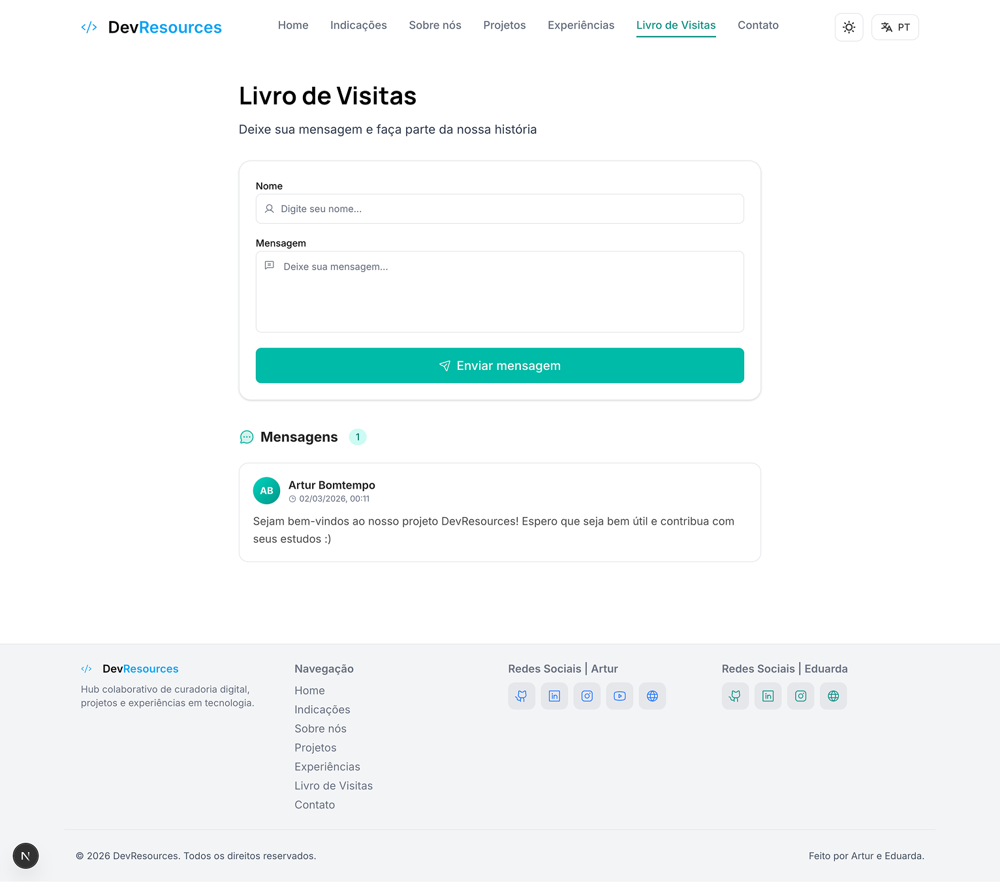

<div align="center">
  <h1>Dev Resources</h1>
  
  <p>
    
    
    
  </p>
  
  <p>
    
    
    
    
    
    
    
    
    
  </p>
</div>

<br>

<div align="justify">
O <b>Dev Resources</b> é uma plataforma de curadoria de recursos técnicos, criada por <a href="https://github.com/arturbomtempo-dev">Artur Bomtempo</a> e <a href="https://github.com/eduardavieira-dev">Eduarda Vieira</a>, estudantes de Engenharia de Software da PUC Minas. O objetivo é centralizar materiais confiáveis, projetos de referência e documentações para facilitar o aprendizado e a atualização profissional. A plataforma oferece contato direto com os desenvolvedores, incluindo o <b>Livro de Visitas</b> para feedbacks e sugestões, e promove uma cultura de colaboração. O projeto adota boas práticas de engenharia de software, com documentação técnica, testes automatizados (E2E e unitários/integrados) e foco em qualidade.
</div>

---

## 📚 Índice

- [Links Úteis](#-links-úteis)
- [Sobre o Projeto](#-sobre-o-projeto)
- [Funcionalidades Principais](#-funcionalidades-principais)
- [Tecnologias Utilizadas](#-tecnologias-utilizadas)
- [Arquitetura](#-arquitetura)
- [Instalação e Execução](#-instalação-e-execução)
    - [Pré-requisitos](#pré-requisitos)
    - [Instalação de Dependências](#-instalação-de-dependências)
    - [Como Executar a Aplicação](#-como-executar-a-aplicação)
- [Deploy](#-deploy)
    - [Estrutura de Pastas](#-estrutura-de-pastas)
- [Demonstração](#-demonstração)
    - [Aplicação Web](#-aplicação-web)
- [Documentações utilizadas](#-documentações-utilizadas)
- [Autores](#-autores)
- [Contribuição](#-contribuição)
- [Agradecimentos](#-agradecimentos)
- [Licença](#-licença)

---

## 🔗 Links Úteis

- 🎨 **Figma:** [Protótipo da Aplicação](https://www.figma.com/design/tEP7aXt6oNFQvqBiwcl7lk/Projeto-DevResources?node-id=0-1&t=vz679nUtiYQB9XzV-1)
- 🌐 **Demo Online:** [Acesse a Aplicação Web](https://devresources-artur-eduarda.vercel.app/)

---

## 📝 Sobre o Projeto

O **Dev Resources** é uma plataforma de curadoria de recursos técnicos desenvolvida para resolver um problema comum entre estudantes de Engenharia de Software: a dificuldade de encontrar materiais didáticos confiáveis e de qualidade em meio à abundância de informação disponível na internet. Muitos alunos sabem que querem estudar e se aprofundar, mas não sabem por onde começar ou como filtrar conteúdos relevantes, resultando em uma sobrecarga informacional que dificulta o aprendizado.

Criado por estudantes de Engenharia de Software da PUC Minas apaixonados por compartilhar conhecimento, o projeto nasceu da vontade de centralizar informações relevantes e confiáveis da área em um único lugar. Como criadores de conteúdo digital, percebemos a necessidade de uma plataforma que não apenas agregasse recursos, mas que oferecesse curadoria, contexto e organização. A plataforma atende estudantes de graduação que buscam projetos de referência e materiais complementares, profissionais que desejam se atualizar, e permite que criadores de conteúdo compartilhem seus recursos e experiências com a comunidade. Além disso, facilita o contato direto entre desenvolvedores e estudantes para troca de conhecimento e esclarecimento de dúvidas.

Ao criar uma ponte entre a abundância de informação e o aprendizado efetivo, o **Dev Resources** contribui para formar profissionais mais preparados, promovendo boas práticas de engenharia de software e uma cultura de colaboração na comunidade acadêmica.

---

## ✨ Funcionalidades Principais

- **Curadoria de Recursos:** Catálogo de links úteis e confiáveis para materiais de tecnologia, documentações e referências técnicas de qualidade.
- **Portfólio de Projetos:** Galeria de projetos desenvolvidos pelos criadores, disponíveis para consulta, inspiração e estudo de código.
- **Sistema de Filtragem:** Ferramentas de busca e filtros avançados para projetos e materiais, facilitando a localização de conteúdos específicos.
- **Sobre os Desenvolvedores:** Seção dedicada às informações, trajetória e experiências dos criadores da plataforma.
- **Página de Contato:** Canal direto de comunicação para dúvidas, sugestões e troca de conhecimento com os desenvolvedores.
- **Livro de Visitas:** Espaço para usuários deixarem mensagens, feedbacks e sugestões, promovendo interação e engajamento.

---

## 🛠 Tecnologias Utilizadas

As seguintes ferramentas, frameworks e bibliotecas foram utilizadas na construção deste projeto. Recomenda-se o uso das versões listadas (ou superiores) para garantir a compatibilidade.

### Front-end

- **Framework:** Next.js 16
- **Biblioteca UI:** React 19
- **Linguagem:** TypeScript 5
- **Estilização:** Tailwind CSS v4
- **Componentes UI:** shadcn/ui
- **Internacionalização:** i18n (custom)
- **Ícones:** Phosphor Icons
- **Linter:** ESLint 10 com simple-import-sort
- **Formatação:** Prettier 3.8 com tailwindcss plugin
- **Fontes:** Google Fonts (Inter, Manrope)
- **Notificações:** Sonner
- **Testes unitários:** Jest
- **Testes E2E:** Playwright
- **Integração com API:** Axios

### Backend & Integrações

- **Banco de dados e autenticação:** Supabase
- **Envio de e-mails:** EmailJS
- **Integração com API do GitHub:** Consumo de dados públicos de usuários e repositórios via GitHub REST API

### Outras ferramentas

- **Processamento de CSS:** PostCSS

### Deploy

- **Plataforma:** Vercel
- **CI/CD:** GitHub Actions

---

## 🏗 Arquitetura

O **Dev Resources** adota uma arquitetura moderna baseada no **Next.js 16** com App Router, aproveitando recursos avançados para criar uma aplicação web performática, escalável e bem organizada.

### Visão Geral

A estrutura do projeto segue o padrão de arquitetura em camadas, com organização clara e modular:

- **Camada de Apresentação (UI):** Componentes React reutilizáveis localizados em `src/components/`, como Header, Footer, Loading, Logo, SectionContainer, ThemeSwitcher, entre outros. Estes componentes são utilizados por diversas páginas, promovendo consistência visual e facilidade de manutenção.
- **Componentes Específicos de Página:** Cada rota principal (como `about`, `contact`, `experiences`, `guestbook`, `indications`, `projects`) pode ter uma pasta `_components` dentro de `src/app/[rota]/`, contendo componentes exclusivos daquela página. Por exemplo, o guestbook possui `GuestbookCard` e `GuestbookForm` em `src/app/guestbook/_components/`.
- **Roteamento:** Utiliza o App Router do Next.js, com rotas baseadas em arquivos e suporte a layouts aninhados, loading states e páginas de erro.
- **Estilização:** Tailwind CSS v4 para estilização utilitária, com componentes UI customizados baseados em shadcn/ui.
- **Utilitários:** Funções auxiliares centralizadas em `src/lib/` para manipulação de dados, classes CSS e integrações.

### Principais Componentes

- **App Router (`src/app/`):** Gerencia todas as rotas da aplicação. Cada pasta representa uma rota, podendo conter subpastas `_components` para componentes exclusivos:
    - `about/` - Página sobre os desenvolvedores (com `CardAbout`, `Pills`)
    - `contact/` - Formulário de contato (com `Button`)
    - `experiences/` - Trajetória e experiências
    - `guestbook/` - Livro de visitas (com `GuestbookCard`, `GuestbookForm`)
    - `indications/` - Links e recursos curados
    - `projects/` - Portfólio de projetos
    - `_components/` - Componentes exclusivos de páginas, como `ContentCard`, `Grainient`

- **Componentes Reutilizáveis (`src/components/`):** Componentes modulares e reutilizáveis, como:
    - `Header/`, `Footer/` - Layout global
    - `Loading/` - Estados de carregamento
    - `Logo/` - Identidade visual
    - `ui/` - Biblioteca de componentes UI (buttons, inputs, etc.)

- **Utilitários (`src/lib/`):** Funções auxiliares para manipulação de classes CSS (clsx, tailwind-merge), integrações e outras utilidades compartilhadas.

- **Testes Automatizados:**
    - **Testes unitários e de integração:** Implementados com Jest, organizados em pastas `__tests__` dentro de cada módulo ou página (`src/app/[rota]/__tests__`, `src/components/__tests__`, etc.), garantindo cobertura de funcionalidades isoladas e integradas.
    - **Testes end-to-end (E2E):** Realizados com Playwright, localizados na pasta `e2e/` na raiz do projeto, simulando fluxos completos do usuário e validando a aplicação como um todo.

### Decisões Arquiteturais

- **Next.js App Router:** Utilizado para rotas baseadas em arquivos, layouts aninhados e Server Components, melhorando performance, SEO e organização.
- **Componentização:** Separação clara entre componentes reutilizáveis (`src/components/`) e exclusivos de página (`src/app/[rota]/_components/`), facilitando manutenção, testes e reuso.
- **TypeScript:** Garantia de type safety, melhor experiência de desenvolvimento e redução de bugs.
- **Tailwind CSS v4:** Estilização utility-first, acelerando o desenvolvimento e garantindo consistência visual.
- **File-Based Routing:** Navegação intuitiva, com rotas diretamente mapeadas para a estrutura de pastas.
- **Testes Automatizados:** Testes unitários/integrados com Jest e E2E com Playwright, assegurando qualidade e robustez.

---

## 🔧 Instalação e Execução

### Pré-requisitos

- **Node.js:** Versão LTS (v22.x ou superior)
- **Gerenciador de Pacotes:** npm ou yarn

---

### 📦 Instalação de Dependências

Clone o repositório e instale as dependências.

1. **Clone o Repositório:**

```bash
git clone https://github.com/arturbomtempo-dev/dev-resources.git
cd dev-resources
```

2. **Instale as Dependências:**

Instale as dependências do projeto Next.js:

```bash
npm install
# ou
yarn install
```

---

### ⚡ Como Executar a Aplicação

Execute a aplicação em modo de desenvolvimento:

```bash
npm run dev
# ou
yarn dev
```

🎨 _A aplicação estará disponível em **http://localhost:3000**._

---

## 🚀 Deploy

O projeto está configurado para deploy automático na Vercel:

1. **Importação do Repositório:** Importe o repositório do GitHub na [Vercel](https://vercel.com)
2. **Configuração Automática:** A Vercel detecta automaticamente o projeto Next.js e aplica as configurações necessárias
3. **Deploy Contínuo:** Cada push na branch principal gera um novo deploy automaticamente

Para testar o build de produção localmente:

```bash
npm run build
npm start
```

---

### 📂 Estrutura de Pastas

A estrutura do projeto segue as convenções do Next.js 16 com App Router, organizando código, componentes e recursos de forma clara e escalável.

```
dev-resources/
├── .gitignore                   # 🧹 Arquivos e pastas ignorados pelo Git
├── .prettierrc                  # 🎨 Configuração do Prettier para formatação de código
├── .vscode/                     # ⚙️ Configurações do VS Code (opcional)
├── README.md                    # 📘 Documentação principal do projeto
├── components.json              # 🧩 Configuração do shadcn/ui
├── docs/                        # 📚 Documentação auxiliar
│   └── TESTING.md               # 🧪 Guia de testes
├── e2e/                         # 🎭 Testes end-to-end (Playwright)
│   ├── fixtures/                # 🧰 Fixtures de testes
│   └── *.spec.ts                # ✅ Cenários E2E
├── eslint.config.mjs            # ✨ Configuração do ESLint para qualidade de código
├── helpers/                     # 🛟 Utilitários de suporte para testes
│   └── *.ts
├── next.config.ts               # ⚙️ Configurações do Next.js
├── next-env.d.ts                # 📝 Tipos TypeScript do Next.js
├── package.json                 # 📦 Dependências e scripts do projeto
├── package-lock.json            # 🔒 Lockfile das dependências
├── playwright.config.ts         # 🎭 Configuração do Playwright
├── postcss.config.mjs           # 🎨 Configuração do PostCSS
├── resources/                   # 📂 Recursos do projeto
│   ├── demonstrations/          # 🎥 GIFs e demonstrações
│   └── prototype/               # 📸 Screenshots do protótipo Figma
├── tsconfig.json                # 📘 Configuração do TypeScript
├── public/                      # 🌍 Arquivos públicos (assets e mídias)
│   ├── developers/
│   ├── not-found/
│   └── projects/
└── src/                         # 📂 Código-fonte da aplicação
    ├── __mocks__/               # 🧪 Mocks para testes
    ├── app/                     # 📂 App Router (rotas e layouts)
    │   ├── _components/         # 🧩 Componentes compartilhados do app
    │   ├── __tests__/           # 🧪 Testes das páginas base
    │   ├── about/
    │   ├── contact/
    │   ├── experiences/
    │   ├── guestbook/
    │   ├── indications/
    │   └── projects/
    ├── components/              # 📂 Componentes React reutilizáveis
    │   ├── Footer/
    │   ├── Header/
    │   ├── IconBox/
    │   ├── LanguageSwitcher/
    │   ├── Loading/
    │   ├── Logo/
    │   ├── SectionContainer/
    │   ├── Subtitle/
    │   ├── ThemeSwitcher/
    │   ├── Title/
    │   └── ui/
    ├── config/                  # ⚙️ Configurações da aplicação
    ├── data/                    # 🗂️ Conteúdo estático e tipagens
    │   ├── en/
    │   ├── pt/
    │   └── types/
    ├── hooks/                   # 🪝 Hooks customizados
    ├── lib/                     # 📂 Utilitários e integrações
    │   ├── i18n/
    │   ├── supabase/
    │   └── theme/
    ├── services/                # 🔌 Serviços externos
    │   ├── github/
    │   └── guestbook/
    └── test-utils/              # 🧪 Utilitários de teste
```

---

## 🎥 Demonstração

Veja a aplicação funcionando em tempo real:

#### Página Inicial (Home)


_Navegação fluida com header transparente que se adapta ao scroll, animações suaves e design responsivo da página inicial com hero section e gradiente animado WebGL._

---

> Mais demonstrações em vídeo de outras páginas serão adicionadas em breve.

### 🌐 Aplicação Web

Para melhor visualização, as telas principais estão organizadas lado a lado.

|                                             Tela                                             |                                      Captura de Tela                                       |
| :------------------------------------------------------------------------------------------: | :----------------------------------------------------------------------------------------: |
|                                  **Página Inicial (Home)**                                   |                                       **Sobre Nós**                                        |
|  |              |
|                                        **Indicações**                                        |                                      **Experiências**                                      |
|      |  |
|                                         **Projetos**                                         |                                        **Contato**                                         |
|           |           |
|                                     **Livro de Visitas**                                     |                                        **Erro 404**                                        |
|  |      |

---

## 📖 Livro de Visitas

Uma seção interativa onde visitantes podem deixar mensagens, comentários e feedback sobre a plataforma. Acesse a página de [Livro de Visitas](/guestbook) para compartilhar sua experiência com o Dev Resources.

### Funcionalidades

- ✍️ **Deixar Mensagens:** Registre suas impressões e sugestões sobre o projeto
- 💬 **Visualizar Comentários:** Veja o que outros visitantes acharam da plataforma
- 🌟 **Avaliações:** Compartilhe sua opinião com uma experiência simples e intuitiva

---

## 🔗 Documentações utilizadas

- 📖 **Next.js:** [Documentação Oficial do Next.js](https://nextjs.org/docs)
- 📖 **React:** [Documentação Oficial do React](https://react.dev/reference/react)
- 📖 **TypeScript:** [Documentação do TypeScript](https://www.typescriptlang.org/docs/)
- 📖 **Tailwind CSS:** [Documentação do Tailwind CSS](https://tailwindcss.com/docs)
- 📖 **Vercel:** [Documentação de Deploy da Vercel](https://vercel.com/docs)

---

## 👥 Autores

Conheça os desenvolvedores responsáveis por este projeto:

| 👤 Nome                  | 🖼️ Foto                                                                                                                                           | :octocat: GitHub                                                                                                                                                                                   | 💼 LinkedIn                                                                                                                                                                                                                          | 📤 Gmail                                                                                                                                                                                                 |
| ------------------------ | ------------------------------------------------------------------------------------------------------------------------------------------------- | -------------------------------------------------------------------------------------------------------------------------------------------------------------------------------------------------- | ------------------------------------------------------------------------------------------------------------------------------------------------------------------------------------------------------------------------------------ | -------------------------------------------------------------------------------------------------------------------------------------------------------------------------------------------------------- |
| Artur Bomtempo Colen     | <div align="center"></div>  | <div align="center"><a href="https://github.com/arturbomtempo-dev"></a></div> | <div align="center"><a href="https://www.linkedin.com/in/artur-bomtempo/"></a></div>                          | <div align="center"><a href="mailto:arturbcolen@gmail.com"></a></div>                |
| Eduarda Vieira Gonçalves | <div align="center"></div> | <div align="center"><a href="https://github.com/eduardavieira-dev"></a></div> | <div align="center"><a href="https://www.linkedin.com/in/eduarda-vieira-gon%C3%A7alves-01a584297/"></a></div> | <div align="center"><a href="mailto:eduarda.vieira.goncalves7@gmail.com"></a></div> |
| Henrique Azevedo Flores  | <div align="center"></div>  | <div align="center"><a href="https://github.com/Zev1n"></a></div>             | <div align="center"><a href="https://www.linkedin.com/in/henrique-azevedo-flores-278611235/"></a></div>       | <div align="center"><a href="mailto:henriqueflores2003@gmail.com"></a></div>         |

---

## 🤝 Contribuição

Guia para contribuições ao projeto.

1.  Faça um `fork` do projeto.
2.  Crie uma branch para sua feature (`git checkout -b feature/minha-feature`).
3.  Commit suas mudanças (`git commit -m 'feat: Adiciona nova funcionalidade X'`). **(Utilize [Conventional Commits](https://www.conventionalcommits.org/en/v1.0.0/))**
4.  Faça o `push` para a branch (`git push origin feature/minha-feature`).
5.  Abra um **Pull Request (PR)**.

---

## 🙏 Agradecimentos

Esta seção reconhece as instituições, professores e iniciativas que contribuíram significativamente para a realização deste projeto acadêmico.

- [**Engenharia de Software PUC Minas**](https://www.instagram.com/engsoftwarepucminas/) - Pelo suporte institucional, infraestrutura acadêmica e incentivo à aplicação prática de conhecimentos técnicos em engenharia de software.

- [**Prof. Dr. João Paulo Aramuni**](https://github.com/joaopauloaramuni) - Pela orientação acadêmica e oportunidade oferecida para o desenvolvimento deste projeto, possibilitando a aplicação de conceitos e metodologias de engenharia de software em um contexto real.

- [**WebTech Network**](https://webtech.network/) - Projeto de extensão da PUC Minas que tem proporcionado oportunidades práticas para desenvolvimento de habilidades em tecnologias front-end e back-end, complementando a formação acadêmica com experiência aplicada em projetos reais.

---

## 📄 Licença

Este projeto é distribuído sob a **[Licença MIT](./LICENSE.md)**.
